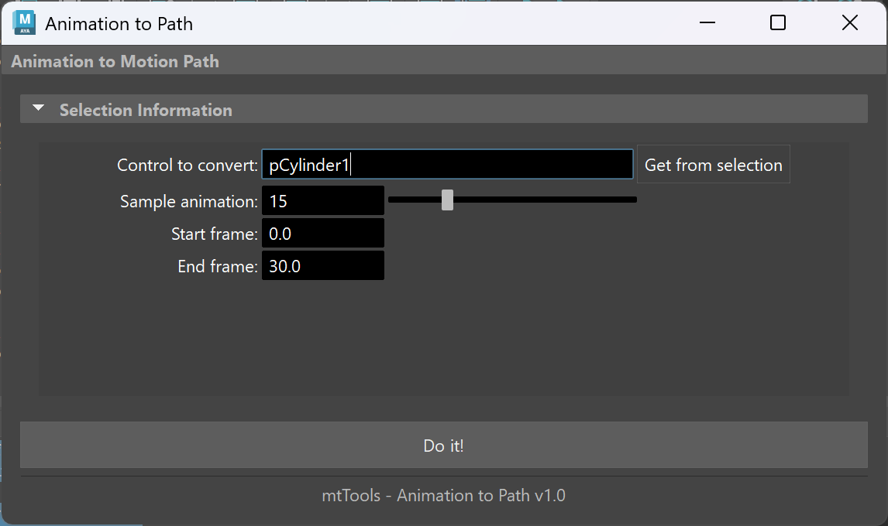

# MT Animation to Path


A Maya utility that converts keyframe animation to editable motion paths.



## Features

- Convert complex keyframe animation to smooth, editable paths
- Customize sampling rate to balance detail and performance
- Maintain proper orientation along the motion path
- Works with any animated transform node
- Fully undoable operation

## Installation

1. Clone or download this repository
2. Copy the `mt_anim_to_path.py` file to your Maya scripts directory:
   - Windows: `Documents\maya\scripts`
   - macOS: `~/Library/Preferences/Autodesk/maya/scripts`
   - Linux: `~/maya/scripts`

## Usage

### Python Script

```python
import mt_anim_to_path as mta
mta.show_gui()
```

### Shelf Button

Create a shelf button with the following Python code:

```python
import mt_anim_to_path as mta
mta.show_gui()
```

## Quick Guide

1. Select the object with keyframe animation
2. Click "Get from selection" to update the control field
3. Adjust the sample rate (higher value = more detailed path)
4. Set the start and end frames if needed
5. Click "Do it!" to convert the animation to a path

After conversion, you can edit the generated curve to adjust the animation path while maintaining proper orientation.

## Requirements

- Maya 2020 or higher

## License

This project is licensed under the MIT License.

---

Created by LostFocusRemedies