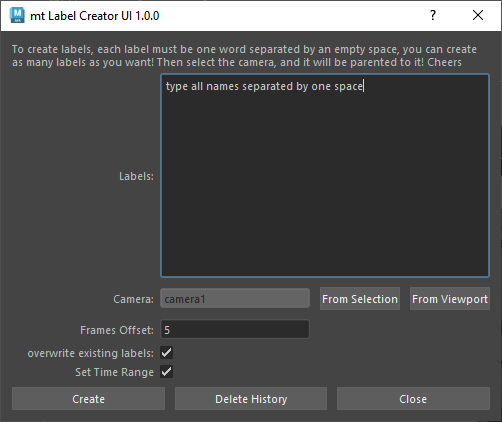

# mtLabelCreator


A Maya tool for creating animated text labels in a 3D viewport. Designed for character animation studies and studio libraries to better present poses and animations.

## Overview

mtLabelCreator generates animated text labels that sequentially appear and disappear at specified frame intervals. Labels are automatically parented to a camera to maintain consistent viewport positioning. This tool is particularly useful for animators who need to label different poses or animation states for review and reference.



## Features

- Create text labels that sequentially appear and disappear
- Automatically parent labels to a camera
- Control frame offset between labels
- Option to overwrite existing labels
- Option to preserve type history (for editing text later)
- Automatic time range adjustment
- Easy-to-use UI interface

## Requirements

- Maya (tested with Maya 2020+)
- PySide2

## Installation

1. Download the `mtLabelCreator.py` file
2. Place it in your Maya scripts directory:
   - Windows: `C:\Users\<username>\Documents\maya\scripts`
   - macOS: `~/Library/Preferences/Autodesk/maya/scripts`
   - Linux: `~/maya/scripts`

## Usage

### Via Python Script

```python
import mtLabelCreator as mtlc
reload(mtlc)

# Create labels with a space-separated string
names = "walk run jump idle"
mtlc.labelCreator(names=names, frameOffset=5)
```

### Via UI

```python
# First time use:
from mtLabelCreator import LabelCreatorUI
LabelCreatorUI.show_dialog()

# While developing:
import mtLabelCreator as mtlc
reload(mtlc)

try:
   LabelCreatorUI.close()
   LabelCreatorUI.deleteLater()
except:
   pass

LabelCreatorUI = mtlc.LabelCreatorUI()
LabelCreatorUI.show()
```

## UI Controls

- **Labels**: Enter all label names separated by spaces
- **Camera**: Select the camera to parent labels to
  - From Selection: Use currently selected camera
  - From Viewport: Use current viewport camera
- **Frames Offset**: Duration in frames between each label
- **Overwrite existing labels**: Delete previously created labels
- **Set Time Range**: Automatically adjust timeline to match label animation
- **Create**: Generate the labels
- **Delete History**: Remove history from labels (text will no longer be editable)
- **Close**: Close the UI

## Parameters

- `names` (string): Space-separated label names
- `cam` (string): Name of the camera to parent to (default: "cam")
- `frameOffset` (int): Number of frames between each label (default: 5)
- `overwrite` (bool): Whether to delete existing labels (default: True)
- `preserve` (bool): Whether to preserve type history (default: False)
- `setTimeRange` (bool): Whether to adjust the timeline range (default: True)
- `legacyKeyframes` (bool): Use legacy keyframe animation method (default: False)

## How It Works

The tool creates Maya text objects for each label and places them in a hierarchy:
- `labels_parent_buffer`: Top-level group connected to the camera
- `labels_transforms_buffer`: Group for handling scale and positioning
- `labels_user_buffer`: Group containing the actual text objects

Labels are controlled using condition nodes to show only one label at a time, based on the current frame.

## Notes

- For better performance, use the "Delete History" button after finalizing your labels
- Each label must be a single word when entering in the UI
- The tool starts label animations from the current frame in the timeline