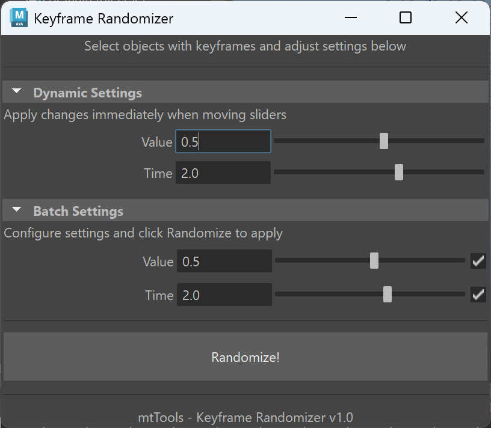

# Maya Keyframe Randomizer


A Maya tool that allows animators to add controlled randomness to selected keyframes, creating more organic and natural animations.



## Features

- Randomize keyframe values within a customizable range
- Randomize keyframe timing within a customizable range
- User-friendly interface with interactive sliders
- Two operation modes:
  - **Dynamic**: See changes immediately as you drag sliders
  - **Batch**: Configure settings and apply with a single click
- Usable via Python API or GUI

## Installation

1. Download `mtRandomKeyframe.py` from this folder
2. Place it in your Maya scripts directory:
   - Windows: `Documents\maya\scripts\`
   - macOS: `~/Library/Preferences/Autodesk/maya/scripts/`
   - Linux: `~/maya/scripts/`
3. To use in Maya, run:
   ```python
   import mtRandomKeyframe as mtk
   mtk.show_gui()