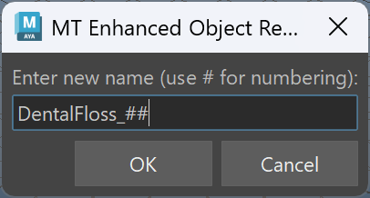

# Renamer


A Maya tool thta helps you with renaming one or more objects in maya. 



## Features

- rename a single object
- hit enter to execture
- works on multiple selection
- auto_numbering
  - explicit with "#"
  - script will assume 3 digits

## Installation

1. Download `mt_renamer.py` from this folder
2. Place it in your Maya scripts directory:
   - Windows: `Documents\maya\scripts\`
   - macOS: `~/Library/Preferences/Autodesk/maya/scripts/`
   - Linux: `~/maya/scripts/`
3. To use in Maya, run:
   ```python
   import mt_renamer as mtr
   mtr.show_gui()