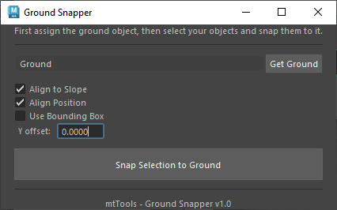
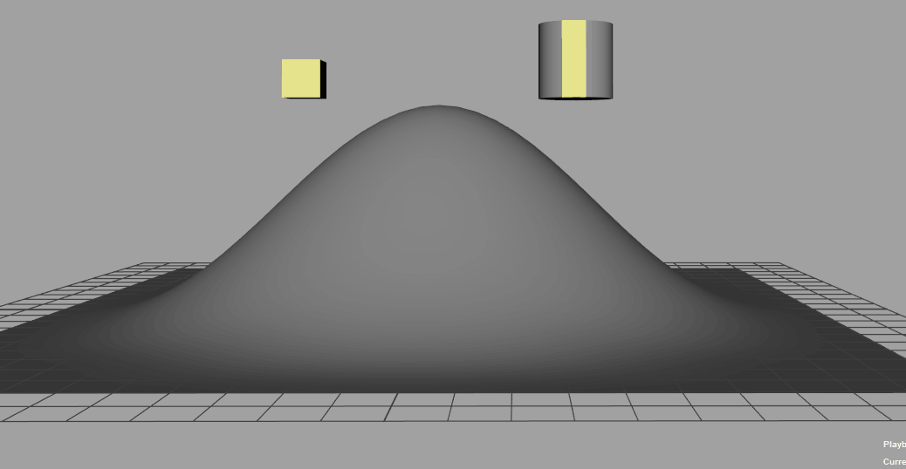

# Ground Snapper


A Maya tool to snap selected object to the ground. 
Especially useful for characters feet.

  


## Features

- Snap objects to any mesh surface
- Align rotation to match ground slope
- Handle bounding box offsets
- Support for rigged controls with Offset Parent Matrix
- Works with both regular transforms and hierarchies
- Simple UI or command-line usage for hotkeys


## Installation

1. Download `mt_snap_to_ground.py` from this folder
2. Place it in your Maya scripts directory:
   - Windows: `Documents\maya\scripts\`
   - macOS: `~/Library/Preferences/Autodesk/maya/scripts/`
   - Linux: `~/maya/scripts/`
3. To use in Maya, you can chose to run it: 
   1. without GUI
      ```python
      import mt_snap_to_ground as mtsg
      snapper = mtsg.GroundSnapper()
      snapper.updateGround("Ground") # <- add here the name of your ground for quick interaction
      snapper.doIt()

   2. with GUI
      ```python
      import mt_snap_to_ground as mtsg
      snapperUi = mtsg.GroundSnapperGUI()
      snapperUi.show()


## TODO:
Please remember this is the very first working version of the tool, so not all cases are covered.

